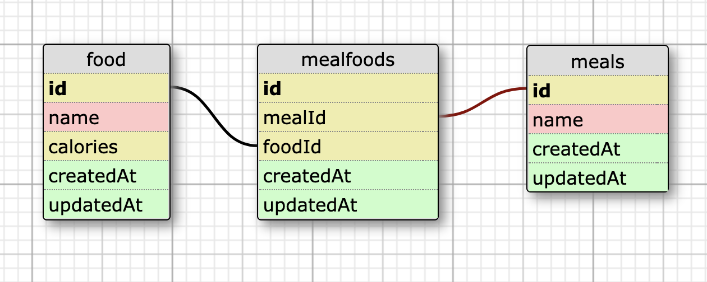

## Inquantifiable Selves - Express

### Overview
This is a group project during Mod 4 at Turing School of Software and design between [Blake Enyart](https://github.com/blake-enyart), [Corey Sheesley](https://github.com/CSheesley), and Vincent Provenzano(https://github.com/Vjp888), where we were exposed to Node.js and Javascript. With a familiarity in an M-V-C architecture, we used this same design pattern as we built out endpoints for `food` and `meal` resources.

**Key Learnings**
* Using JavaScript and Node.js to build out a backend application with a number of endpoints.
* Implementing Jest for testing.
* Project management: Breaking down a feature into multiple user stories, using a project board, implementing a re-basing work flow, providing clear documentation in commit messages and pull requests.

### Endpoints  
#### [inquantifiable-selves.herokuapp.com](https://inquantifiable-selves.herokuapp.com)

**GET /api/v1/foods**  
*returns all food resources*  
Request:
```
Content-Type: application/json
Accept: application/json
```
Response:
```
status: 200
body:
{
  [
    {
      "id": 1,
      "name": "Banana",
      "calories": 150
    },
    {
      "id": 2,
      "name": "Apple",
      "calories": 10
    }
  ]
}
```

**GET /api/v1/foods/:id**  
*returns a single food resource*  
Request:
```
Content-Type: application/json
Accept: application/json
```
Response:
```
status: 200
body:
{
    "id": 1,
    "name": "Banana",
    "calories": 150
}
```

**POST /api/v1/foods**  
*creates a single food resource*  
Request:
```
POST /api/v1/foods
Content-Type: application/json
Accept: application/json

body:
{ "food": 
  {
     "name": "Name of food here",
     "calories": "Calories here"
   }
}
```
Response:
```
status: 201
body:
{ 
  "message": "FOODNAME has been added"

}
```

**PATCH /api/v1/foods/:id**  
*creates a single food resource*  
Request:
```
PATCH /api/v1/foods/:id
Content-Type: application/json
Accept: application/json

{ "food": { "name": "Mint", "calories": "14"} }
```
Response:
```
status: 202
body: 
{
    "id": 1,
    "name": "Mint",
    "calories": 14
}
```

**DELETE /api/v1/foods/:id**  
*deletes a single food resource*  
Request:
```
Content-Type: application/json
Accept: application/json
```
Response:
```
status: 204
```

**GET /api/v1/meals**  
*returns all meal resources*
Request
```
Content-Type: application/json
Accept: application/json
```
Response
```
[
  {
    "id": 1,
    "name": "Breakfast",
    "foods": [
        {
          "id": 1,
          "name": "Banana",
          "calories": 150
      },
      {
        "id": 6,
        "name": "Yogurt",
        "calories": 550
      },
      {
        "id": 12,
        "name": "Apple",
        "calories": 220
      }
    ]
  },
  {
    "id": 2,
    "name": "Snack",
    "foods": [
      {
        "id": 1,
        "name": "Banana",
        "calories": 150
      },
      {
        "id": 9,
        "name": "Gum",
        "calories": 50
      },
      {
        "id": 10,
        "name": "Cheese",
        "calories": 400
      }
    ]
  }
]
```

**GET /api/v1/meals/:meal_id/foods**  
*returns a single meal resource and its foods*
Request:
```
Content-Type: application/json
Accept: application/json
```
Response:
```
status: 200
body:
{
  "id": 1,
  "name": "Breakfast",
  "foods": [
    {
      "id": 1,
      "name": "Banana",
      "calories": 150
    },
    {
      "id": 6,
      "name": "Yogurt",
      "calories": 550
    },
    {
      "id": 12,
      "name": "Apple",
      "calories": 220
    }
  ]
}
```

**POST /api/v1/meals/:meal_id/foods/:id**
*returns a single meal resource and its foods*
Request:
```
Content-Type: application/json
Accept: application/json
```
Response:
```
status: 201
body:
{
    "message": "successfully added FOODNAME to MEALNAME"
}
```

**DELETE /api/v1/meals/:meal_id/foods/:id**
*returns a single meal resource and its foods*
Request:
```
Content-Type: application/json
Accept: application/json
```
Response:
```
status: 204
body:
{
    "message": "Successfully deleted FOODNAME from MEALNAME"
}
```

### Setup
*Database & Models*  
`$ npx sequelize db:create`  
`$ npx sequelize db:migrate`  
`$ npx sequelize db:seed:all`

### Versions
`node 10.16.0`  
`npm 6.9.0`  

### Packages
`$ npm install dotenv`  

### Testing

*Testing*  
`$npm install babel-jest supertest shelljs -D`  
`$npm install jest-cli`   

### Schema

